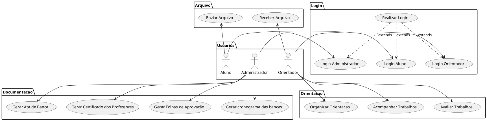

# Especificação dos Requisitos do SITCC

## Requisitos Funcionais

### Lista de Requisitos Funcionais

- [RF01](reqs_RF01.md) - Realizar Login
- [RF02](reqs_RF02.md) - Organizar Orientacao
- [RF03](reqs_RF03.md) - Acompanhar Trabalhos
- [RF04](reqs_RF04.md) - Avaliar Trabalhos
- [RF05](reqs_RF05.md) - Gerar Ata de Banca
- [RF06](reqs_RF06.md) - Gerar Certificado dos Professores
- [RF07](reqs_RF07.md) -Gerar Folhas de Aprovação
- [RF08](reqs_RF08.md) - Gerar cronograma das bancas
- [RF09](reqs_RF09.md) - Enviar Arquivo
- [RF10](reqs_RF10.md) - Receber Arquivo

### Diagrama de Casos de Uso

### Especificações de Casos de Uso

- [UC_01](reqs_UC01.md)
- [UC_02](reqs_UC02.md)
- [UC_03](reqs_UC03.md)
- [UC_04](reqs_UC04.md)
- [UC_05](reqs_UC05.md)
- [UC_06](reqs_UC06.md)
- [UC_07](reqs_UC07.md)
- [UC_08](reqs_UC08.md)
- [UC_09](reqs_UC09.md)
- [UC_010](reqs_UC010.md)
- [UC_011](reqs_UC011.md)
- [UC_012](reqs_UC012.md)
- [UC_013](reqs_UC013.md)

## Requisitos não-funcionais

### Usabilidade

Segundo Jakob Nielsen a “usabilidade é um atributo de qualidade que avalia quão fácil uma interface é de usar”, ou  “a medida de qualidade da experiência de um usuário ao interagir com um produto ou um sistema”. Em outras palavras a usabilidade está associada à utilização de métodos que contribuam com a facilidade de uso durante o processo de criação do produto.

## Referências

[1] NILSEN, Jakob. Usabillity Engineering. San Francisco (California), Morgan Kauffmann, 1993. 362p

[2] Ian Somerville ...

[3] Angular ...

[4] PlantUML ...
