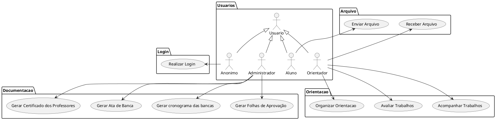

# Especificação dos Requisitos do SITCC

## Requisitos Funcionais

### Lista de Requisitos Funcionais

- RF01 - Realizar Login
- RF02 - Organizar Orientação
- RF03 - Acompanhar Trabalhos
- RF04 - Avaliar Trabalhos
- RF05 - Gerar Ata de Banca
- RF06 - Gerar Certificado dos Professores
- RF07 - Gerar Folhas de Aprovação
- RF08 - Gerar Cronograma das Bancas
- RF09 - Enviar Arquivo
- RF10 - Receber Arquivo

### Diagrama de Casos de Uso

### Especificações de Casos de Uso

- [UC_01](https://github.com/ProjetoEngSoftwareTCCs/ProjetoEngSoftware/blob/main/Especifica%C3%A7%C3%B5es/reqs_UC01.md) - Realizar Login
- [UC_02](https://github.com/ProjetoEngSoftwareTCCs/ProjetoEngSoftware/blob/main/Especifica%C3%A7%C3%B5es/reqs_UC02.md) - Organizar Orientacao
- [UC_03](https://github.com/ProjetoEngSoftwareTCCs/ProjetoEngSoftware/blob/main/Especifica%C3%A7%C3%B5es/reqs_UC03.md) - Acompanhar Trabalhos
- [UC_04](https://github.com/ProjetoEngSoftwareTCCs/ProjetoEngSoftware/blob/main/Especifica%C3%A7%C3%B5es/reqs_UC04.md) - Avaliar Trabalhos
- [UC_05](https://github.com/ProjetoEngSoftwareTCCs/ProjetoEngSoftware/blob/main/Especifica%C3%A7%C3%B5es/reqs_UC05.md) - Gerar Ata de Banca
- [UC_06](https://github.com/ProjetoEngSoftwareTCCs/ProjetoEngSoftware/blob/main/Especifica%C3%A7%C3%B5es/reqs_UC06.md) - Gerar Certificado dos Professores
- [UC_07](https://github.com/ProjetoEngSoftwareTCCs/ProjetoEngSoftware/blob/main/Especifica%C3%A7%C3%B5es/reqs_UC07.md) - Gerar Folhas de Aprovação
- [UC_08](https://github.com/ProjetoEngSoftwareTCCs/ProjetoEngSoftware/blob/main/Especifica%C3%A7%C3%B5es/reqs_UC08.md) - Gerar cronograma das bancas
- [UC_09](https://github.com/ProjetoEngSoftwareTCCs/ProjetoEngSoftware/blob/main/Especifica%C3%A7%C3%B5es/reqs_UC09.md) - Enviar Arquivo
- [UC_10](https://github.com/ProjetoEngSoftwareTCCs/ProjetoEngSoftware/blob/main/Especifica%C3%A7%C3%B5es/reqs_UC10.md) - Receber Arquivo

## Requisitos não-funcionais

### Usabilidade

Segundo Jakob Nielsen a “usabilidade é um atributo de qualidade que avalia quão fácil uma interface é de usar”, ou  “a medida de qualidade da experiência de um usuário ao interagir com um produto ou um sistema”. Em outras palavras a usabilidade está associada à utilização de métodos que contribuam com a facilidade de uso durante o processo de criação do produto.

## Referências

* [NILSEN, Jakob. Usabillity Engineering. San Francisco (California), Morgan Kauffmann, 1993. 362p.](https://www.amazon.com.br/Usability-Engineering-Jakob-Nielsen/dp/0125184069/ref=sr_1_1?keywords=usability+engineering&qid=1641263417&sprefix=usab%2Caps%2C162&sr=8-1&ufe=app_do%3Aamzn1.fos.4bddec23-2dcf-4403-8597-e1a02442043d)

* [SOMMERVILLE, Ian. Engenharia de Software. Pearson University, 2019. 768p.](https://www.amazon.com.br/Engenharia-Software-Ian-Sommerville/dp/8543024978/ref=sr_1_1?keywords=ian+sommerville&qid=1641263109&sprefix=ian+sommer%2Caps%2C236&sr=8-1&ufe=app_do%3Aamzn1.fos.db68964d-7c0e-4bb2-a95c-e5cb9e32eb12)  

* [PlantUML](https://plantuml.com/use-case-diagram)

* [TypeScript](https://www.typescriptlang.org/)

